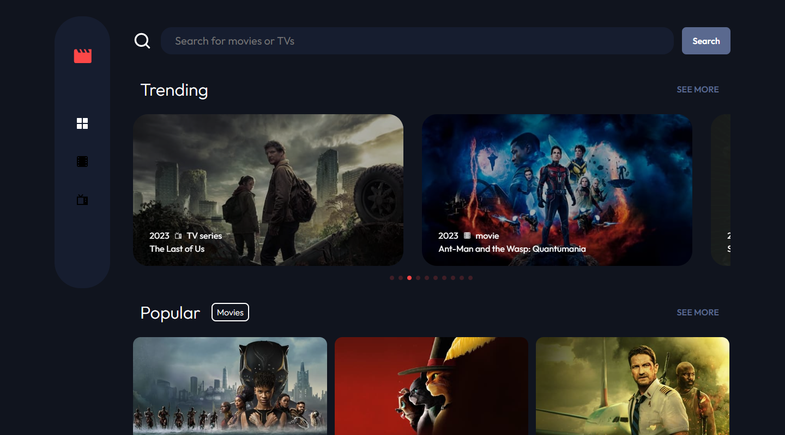

## Table of contents

- [Overview](#overview)
- [Links](#links)
- [Built with](#built-with)
- [What I Learned](#what-i-learned)

## Overview

using the [TMDB API](https://developers.themoviedb.org/3) to get the list of different movies and shows,
the app organize them into different category sections where you can hit "see more" to go to the category
page where you can select the movie/show category that you like and also search for the movie/show that you want to find.
also in the navigation there is a movies only and tv shows only page.

### Links

- [Live Site URL](https://yacinekahlerras.github.io/entertainement-app/)

### Built with

- [NextJs](https://nextjs.org/)
- [React](https://reactjs.org/)
- [SCSS](https://sass-lang.com/)
- [TMDB API](https://developers.themoviedb.org/3)
- [React Router](https://reactrouter.com/en/main)
- [Spinner](https://mhnpd.github.io/react-loader-spinner/docs/components/oval)
- [Lazy Load image](https://www.npmjs.com/package/react-lazy-load-image-component)

### What I Learned

- migrated this app from a create-react-app to NextJs to hide the TMDB api key in the env variable
  it was a lot less work than what i thought but it was still a bit annoying switching all the
  Links and the react-router-dom apis to the next router apis.
- i gained a better undersanding of how to handle api's because they do not always show the same informations
  or be non-existant or have them in as something different, also reading the documentations and finding
  all the cool ways that i can do with the api is really fun
- giving the client feedback on what it going on when loading instead of appearing freezed.
- lazy load images to inhance performance and smoothness of the app
